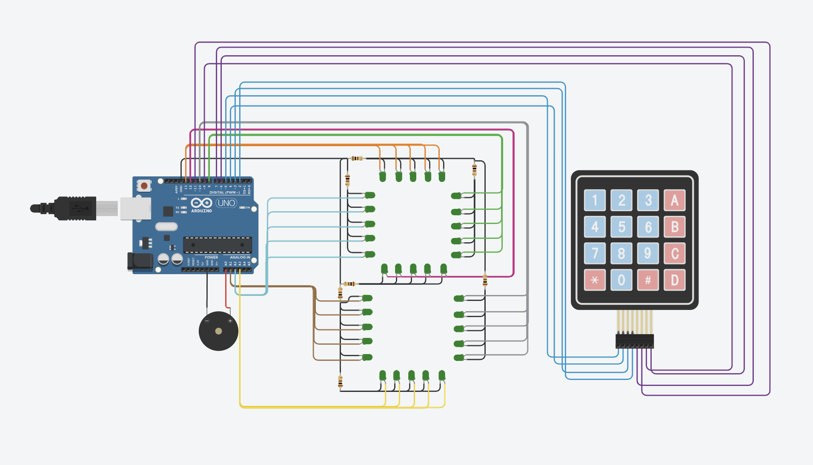
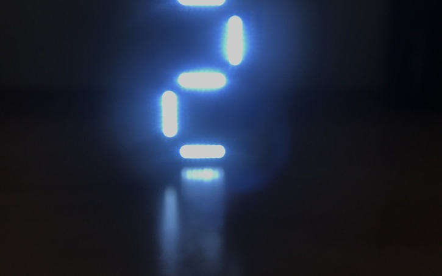
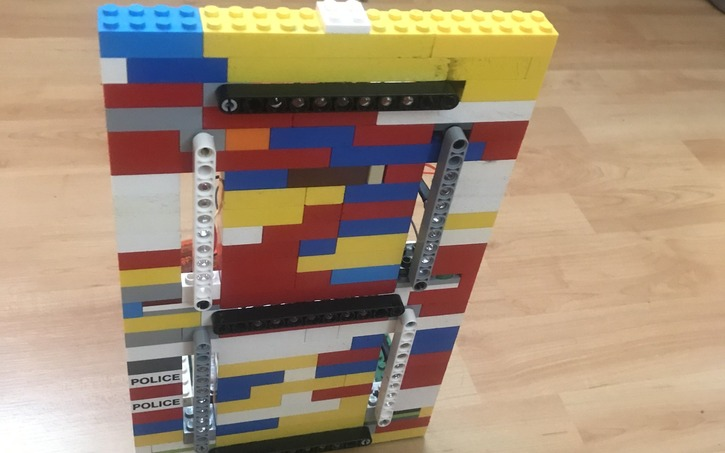
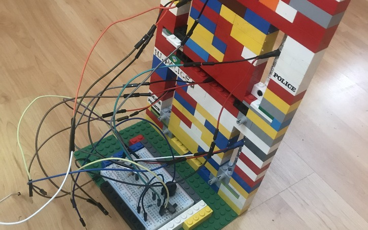
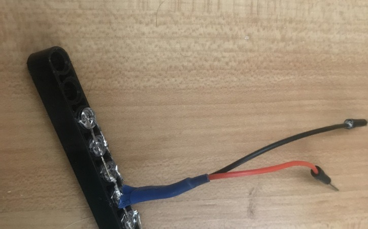

# LCD

  

> Version: **1.0.1**

---

## Table of Contents

- [About](#about)
- [Components](#components)
- [Schematic](#schematic)
- [Images](#images)
- [Installation](#installation)
- [Usage](#usage)
- [Changelog](#changelog)
- [Contributing](#contributing)
- [License](#license)
- [Authors](#authors)

## About

`LCD` is a simple Lego 7-segment display made with Arduino.

> **Note:** This project can be used for any project that uses a 7-segment display.

## Components

- 1x Arduino Uno
- 1x 4x4 Keypad
- 1x Buzzer
- 25x Leds
- 5x 100 Ohm Resistors
- Some wires

## Schematic

## Images

  
  
  
  

## Installation

1. Clone the repository
2. Open the `LCD.ino` file with the Arduino IDE
3. Upload the code to the Arduino Uno

## Usage

1. Connect the Arduino Uno to the computer
2. Press the `*` key to start the counter
3. Press the `#` key to start the reverse counter
4. Press another key to display corresponding number or letter

## Changelog

see [CHANGELOG.md](CHANGELOG.md) for changes

## Contributing

Contributing is disabled for this repository

## License

This project is licensed under the AGPL v3 License - see the [LICENSE.md](LICENSE.md) file for details

## Authors

- [@Zarox28](https://github.com/Zarox28)
